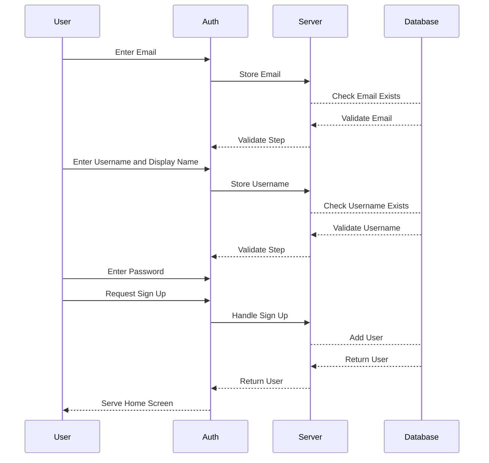
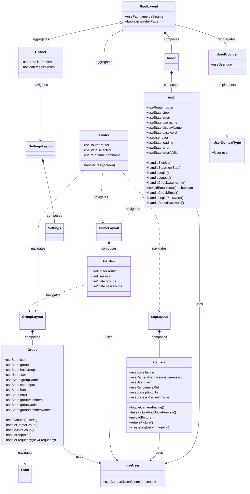

# Growe

# Abstract
A collaborative habit-building app that leverages social accountability to help users establish and maintain positive routines. Users join groups centered around specific habits—such as cleaning, going to the library to study, or exercising—and participate in check-ins that require evidence of their progress in the form of photos (like BeReal). Group members validate each other's check-ins, creating a supportive community that fosters commitment and consistency. If users cumulatively miss the required number of check ins, not only does the streak visibly reset but a beautiful unique plant that was once growing is uprooted and reset (like Forest), adding a gentle layer of peer accountability. To motivate ongoing participation, consistent users earn badges and unlock new plants. By combining habit tracking with peer validation, this idea transforms personal goal-setting into a shared journey, enhancing motivation through collective encouragement and accountability.

**Keywords**: 005, accountability, habits, social, expo, firebase

# Requirements
This app uses React Native Expo as a frontend mobile framework, Firebase as a backend for storing user data, assets, and group data. It also will likely use Stable Diffusion 3.5 Large to generate assets.

# Design
A collaborative habit-building app that leverages social accountability to help users establish and maintain positive routines.

## Asset Generation

  
   
  

_Examples of generating plant assets with Stable Diffusion 3.5 Large._

| Setting            | Value                                                                                                             |
|--------------------|-------------------------------------------------------------------------------------------------------------------|
| **Prompt**         | isolated `{plant_name}` plant at the `{growth_stage}`, white background, isometric perspective, 8-bit pixel art style |
| **Aspect Ratio**   | 1:1                                                                                                               |
| **CFG**            | 3.5                                                                                                               |
| **Prompt Strength**| 0.85 (1.0 might be better)                                                                                        |
| **Steps**          | 40 (35 might be better)                                                                                           |
| **Seed**           | 227468720                                                                                                         |
| **Output Format**  | webp                                                                                                              |
| **Output Quality** | 90                                                                                                                |

_The settings to generate the previous examples. Curly brackets indicate arguments to the template prompt. Growth stages indicate the progression of the plant at a certain life cycle._

| State | Description |
|--------------------|-------------------------------------------------|
| **Sprouting** | sprouting stage where it germinates and grows its first leaf |
| **Seedling** | seedling stage where a small green shoot emerges above the soil with tiny leaves starting to spread |
| **Vegetating** | vegetating stage where the plant grows taller with thickening stems and broadening leaves |
| **Budding** | budding stage where the plant is transitioning to blooming and small buds appear signaling flower formation |
| **Flowering** | flowering stage where the plant displays fully opened and prominent flowers |
| **Fruiting** | fruiting stage where the plant produces fruits as the flowers fade |
| **Dying** | dying stage where the plant turns brown and wilts |
| **Dead** | dead plant |

**Yucca**

  
  
  
  
  
  

**Bird of Paradise**

  
  
  
  
  
  

## Mechanics

### Credits

Users earn credits in a few ways:

1. Each time the user logs a habit for the week (even if the plant dies at the end of the week). User earns extra credits if they log more habits than necessary for the week.
2. Each time the team successfully grows a plant for the week.
3. Every day each plant in the garden is kept alive users can collect a small amount of credits from each plant.

Users can use their credits to buy things for the garden, like pets, paths, decorations, and food to keep the existing plants and animals in the garden alive.

Here are the items planned so far:
| Item | Description |
|--------------------|-------------------------------------------------|
| **Pets** | Animated NPCs that allow plants to live longer without **Fertilizer** |
| **Decorations** | Purely cosmetic items that spruce up the users' garden |
| **Kibble** | Food for **Pets** that keep them alive and healthy |
| **Fertilizer** | Food for plants that keep them alive and healthy |
| **Gaia** | A magic stone that allows users a 50% chance to save a plant that died |

### Unique Events

Events that allow users to skip feeding their existing plants for the week.

- It will randomly rain on occasion.
- A rainbow will appear.
- Rare animal visiting.

### Habit Guidance

Provide guidance on how to choose and formulate a good habit.

### Nudges

If users are not meeting goals consistently or are constantly exceeding goals, give nudges for recommendations to adjust.

### Reflection

Users can write an optional reflection that gives them the opportunity to write about their high and low of the week. Pair this with rewarding animations of the plant and pets.

### Badges

Certain badges are rewarded for unique accomplishments.

### Streaks

Streaks of multiple weeks of successfully growing a plant give users the opportunity to keep growing. Maybe give the opportunity to plant a tree at long term streak?

### Pledges

Make pledges at the beginning of the week to commit to n days that will log a habit. Get extra credit if user logs on those predicted days.

## User Interface

  
  
  
  
  
  
  

## Database Collections

## Class Diagram

# Background
This is the life cycle of a user on this app for a three person group with the goal to workout 3 days a week:

1. User creates account.
8. Add friends by username.
9. Create group.
10. Choose a habit. A good example is to go for a run 3 days a week. A bad example is run 1 mile three days a week. It shouldn't need to be quantified, only specific enough that can be verified from a simple photo. qualitative > quantitative.
11. Set minimum frequency of check-in (i.e. work out 3 days a week).
12. Invite friends to join.
13. At the start of every period (i.e. week), given a library of plants to choose from (will auto-pick if not chosen). plants are standard and take minimum frequency (i.e. 3 users * 3 days = 9 total check-ins for the week), while accessories to the garden may take a multiplier of more check-ins (i.e. 3 users * 3 days + 3 extra = 12 total check-ins for the week).
14. Users take a picture of their workout (not from camera roll) at their discretion three times on separate days of the week.
15. Users must endorse it as valid, can also upvote and comment.
16. Every time a user's check-in is endorsed as valid by everyone, the plant or accessory grows or progresses respectively.
17. If users do not collectively reach the required number of check-ins, the plant that was growing dies.
18. Repeat from step 9.

# References
- https://bereal.com/
- https://www.forestapp.cc/
- https://expo.dev/
- https://openai.com/index/dall-e-3/

## Collaborators

[//]: # ( readme: collaborators -start )
<table>
<tr>
    <td align="center">
        <a href="https://github.com/gutbash">
            
             
            <b>Bash</b>
        </a>
    </td>
    <td align="center">
        <a href="https://github.com/khanhquocng2801">
            
             
            <b>Khan</b>
        </a>
    </td>
    <td align="center">
        <a href="https://github.com/omarshakir8">
            
             
            <b>Omar</b>
        </a>
    </td>
    <td align="center">
        <a href="https://github.com/Ruben-amalgam">
            
             
            <b>Ruben</b>
        </a>
    </td>
    <td align="center">
        <a href="https://github.com/tus29603">
            
             
            <b>Tes</b>
        </a>
    </td>
    <td align="center">
        <a href="https://github.com/Youngdoul">
            
             
            <b>Doul</b>
        </a>
    </td>
</tr>
</table>

[//]: # ( readme: collaborators -end )
