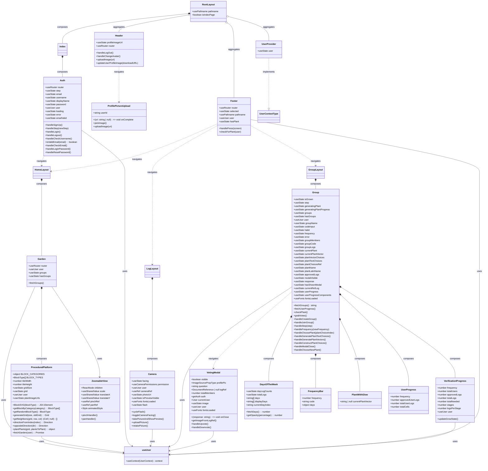

# System Block Diagram

## Class Diagram

```mermaid
classDiagram
  RootLayout *-- Index : composes
  RootLayout o-- Header : aggregates
  RootLayout o-- Footer : aggregates
  RootLayout o-- UserProvider : aggregates
  Index *-- Auth : composes
  GroupLayout *-- Group : composes
  HomeLayout *-- Garden : composes
  LogLayout *-- Camera : composes
  Auth ..> HomeLayout : navigates
  Footer ..> HomeLayout : navigates
  Footer ..> LogLayout : navigates
  Footer ..> GroupLayout : navigates
  UserProvider ..|> UserContextType : implements
  Auth --> useUser : uses
  Camera --> useUser : uses
  Garden --> useUser : uses
  Group --> useUser : uses
  Footer --> useUser : uses
  ProceduralPlatform --> useUser : uses
  VotingModal --> useUser : uses
  VerificationProgress --> useUser : uses
  Group ..> VotingModal : navigates
  Garden *-- ProceduralPlatform : composes
  Header ..> ProfilePictureUpload : navigates
  Garden --> ZoomableView : uses
  Group *-- DaysOfTheWeek : composes
  Group *-- FrequencyBar : composes
  Group *-- PlantWithGlow : composes
  Group *-- UserProgress : composes
  Group *-- VerificationProgress : composes
  
  class RootLayout {
    +usePathname<Pathname> pathname
    +boolean isIndexPage
  }
  class Index
  class GroupLayout
  class HomeLayout
  class LogLayout
  class Auth {
    +useRouter<Router> router
    +useState<Step> step
    +useState<string> email
    +useState<string> username
    +useState<string> displayName
    +useState<string> password
    +useUser<User> user
    +useState<boolean> loading
    +useState<string> error
    +useState<boolean> emailValid

    +handleSignUp()
    +handleStep(newStep)
    +handleLogin()
    +handleLogout()
    +handleCheckUsername()
    +isValidEmail(email) : boolean
    +handleCheckEmail()
    +handleLoginPassword()
    +handleResetPassword()
  }
  class Camera {
    +useState<CameraType> facing
    +useCameraPermissions<CameraPermissions> permission
    +useUser<User> user
    +useRef<CameraView> cameraRef
    +useState<string | null> photoUri
    +useState<boolean> isPreviewVisible
    +useFonts fontsLoaded
    +useState<number> flash

    +cycleFlash()
    +toggleCameraFacing()
    +takePictureAndShowPreview()
    +uploadPicture()
    +retakePicture()
  }
  class Footer {
    +useRouter<Router> router
    +useState<string> selected
    +usePathname<Pathname> pathname
    +useUser<User> user
    +useState<boolean> hasPlant

    +handlePress(screen)
    +checkForPlant(user)
  }
  class Garden {
    +useRouter<Router> router
    +useUser<User> user
    +useState<DocumentReference[]> groups
    +useState<boolean> hasGroups

    +fetchGroups()
  }
  class Group {
    +useState<boolean> isGrown
    +useState<Step> step
    +useState<boolean> generatingPlant
    +useState<number> generatingPlantProgress
    +useState<DocumentReference[]> groups
    +useState<boolean> hasGroups
    +useUser<User> user
    +userState<string> groupName
    +useState<string> codeInput
    +useState<string> habit
    +useState<number> frequency
    +useState<string> error
    +useState<DocumentReference[]> groupMembers
    +useState<string> groupCode
    +useState<DocumentReference[]> groupLogs
    +useState<DocumentReference[] | null> currentPlant
    +useState<string | null> currentPlantVector
    +useState<string[]> plantVectorChoices
    +useState<PlantTextChoice[]> plantTextChoices
    +useState<DocumentReference | null> plantChoicesRef
    +useState<string> plantName
    +useState<string> plantLatinName
    +useState<DocumentReference[]> approvedLogs
    +useState<boolean> modalVisible
    +useState<string | null> response
    +useState<boolean> hasShownModal
    +useState<DocumentReference | null> currentRefLog
    +useState<object[]> userProgress
    +useState<JSX.Element[]> userProgressComponents
    +useFonts fontsLoaded

    +fetchGroups() string
    +fetchUserProgress()
    +checkPlant()
    +grabVotes()
    +handleCreateGroup()
    +handleJoinGroup()
    +handleStep(step)
    +handleFrequency(newFrequency)
    +handleChoosePlant(plantChoiceIndex)
    +handleGeneratePlantTextChoices()
    +handleGeneratePlantVectors()
    +handleConstructPlantChoices()
    +handleModalClose()
    +handleChooseNewPlant()
  }
  class Header {
    +useState<string | null> profileImageUrl
    +useRouter<Router> router

    +handleLogOut()
    +handleChangeAvatar()
    +uploadImage(uri)
    +updateUserProfileImage(downloadURL)
  }
  class ProceduralPlatform {
    +object BLOCK_CATEGORIES
    +BlockType[] BLOCK_TYPES
    +number tileWidth
    +number tileHeight

    +useState<number> gridSize
    +useState<Grid> grid
    +useUser<User> user
    +userState<string[]> plantImageUrls

    +BlockSVG(blockType) : JSX.Element
    +getBlockByCategory(category) : BlockType[]
    +getRandomBlockType() BlockType
    +generateGrid(size, oldGrid) : Grid
    +getNeighbors(grid, row, col) : (Cell | null)[]
    +directionFromIndex(index) : Direction
    +oppositeDirection(dir) : Direction
    +plantPlants(grid, plantsToPlant) : object
    +fetchGarden(user) : Promise<void>
  }

  class ProfilePictureUpload {
    +string userId
    +(uri: string | null) => void onComplete

    +pickImage()
    +uploadImage(uri)
  }

  class UserProvider {
    +useState<User | null> user
  }
  class useUser {
    +useContext(UserContext) context
  }

  class VotingModal {
    +boolean visible
    +(response: string) => void onClose
    +ImageSourcePropType profilePic
    +string question
    +DocumentReference<DocumentData, DocumentData> | null logRef
    +number totalMembers

    +getAuth auth
    +User currentUser
    +useState<string> image
    +useUser<User> user
    +useFonts fontsLoaded

    +getImageFromLogRef()
    +handleUpvote()
    +handleDownvote()
  }

  class ZoomableView {
    +ReactNode children
    +useSharedValue<number> scale
    +useSharedValue<number> translateX
    +useSharedValue<number> translateY
    +useRef pinchRef
    +useRef panRef
    +Style animatedStyle

    +pinchHandler()
    +panHandler()
  }

  class DaysOfTheWeek {
    +useState<object> dayLogCounts
    +useState<number> totalLogs
    +string[] days
    +string[] displayDays
    +string currentDayIndex

    +fetchDays() : number
    +getOpacity(percentage) : number
  }

  class FrequencyBar {
    +number frequency
    +string code
    +object days
  }

  class PlantWithGlow {
    +string | null currentPlantVector
  }

  class UserProgress {
    +number frequency
    +number approvedUserLogs
    +number totalUserLogs
    +number totalCells
  }

  class VerificationProgress {
    +number frequency
    +number totalUsers
    +number approvedLogs
    +number totalLogs

    +number totalNeeded
    +number stages
    +number logsPerStage
    +useUser<User> user

    +updateGrowState()
  }
```