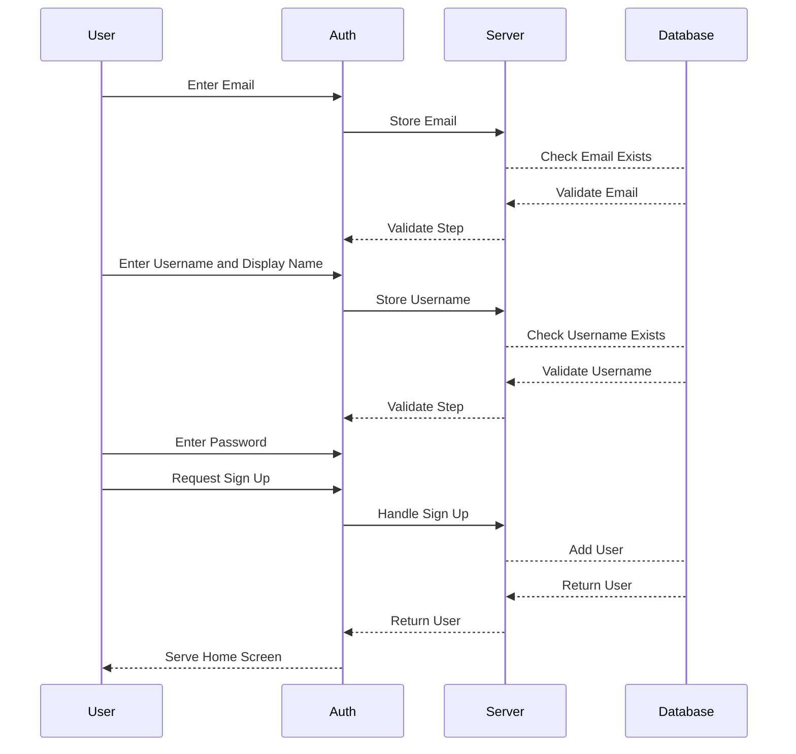
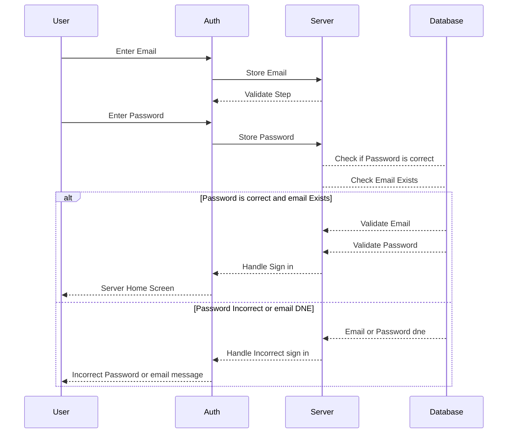
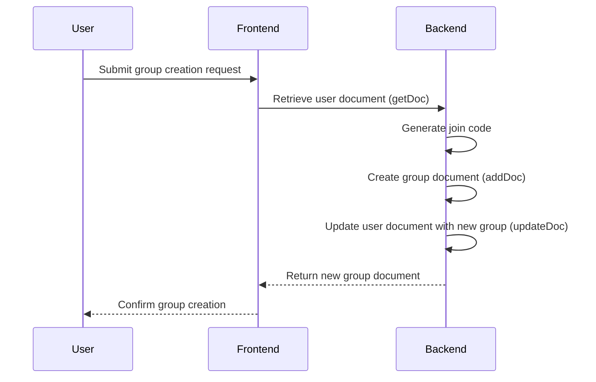
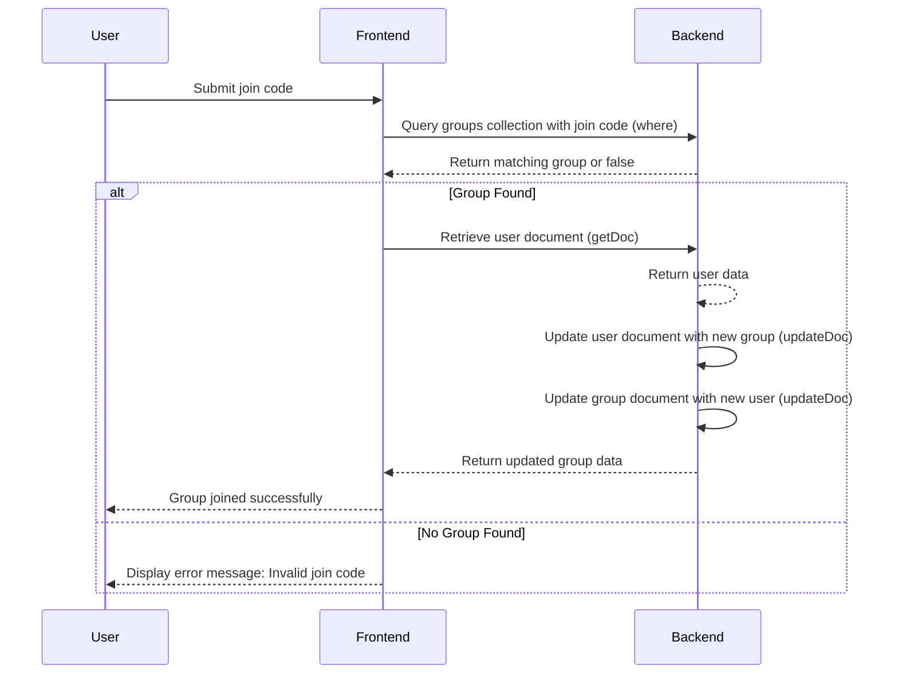

# Use-case descriptions / Sequence Diagram

## Use Case: Signing Up from login page

## Use Case: Logging in

## Use Case: Creating Group after successfully login or sign up

## Use Case: Join Group after successfully login / signup

